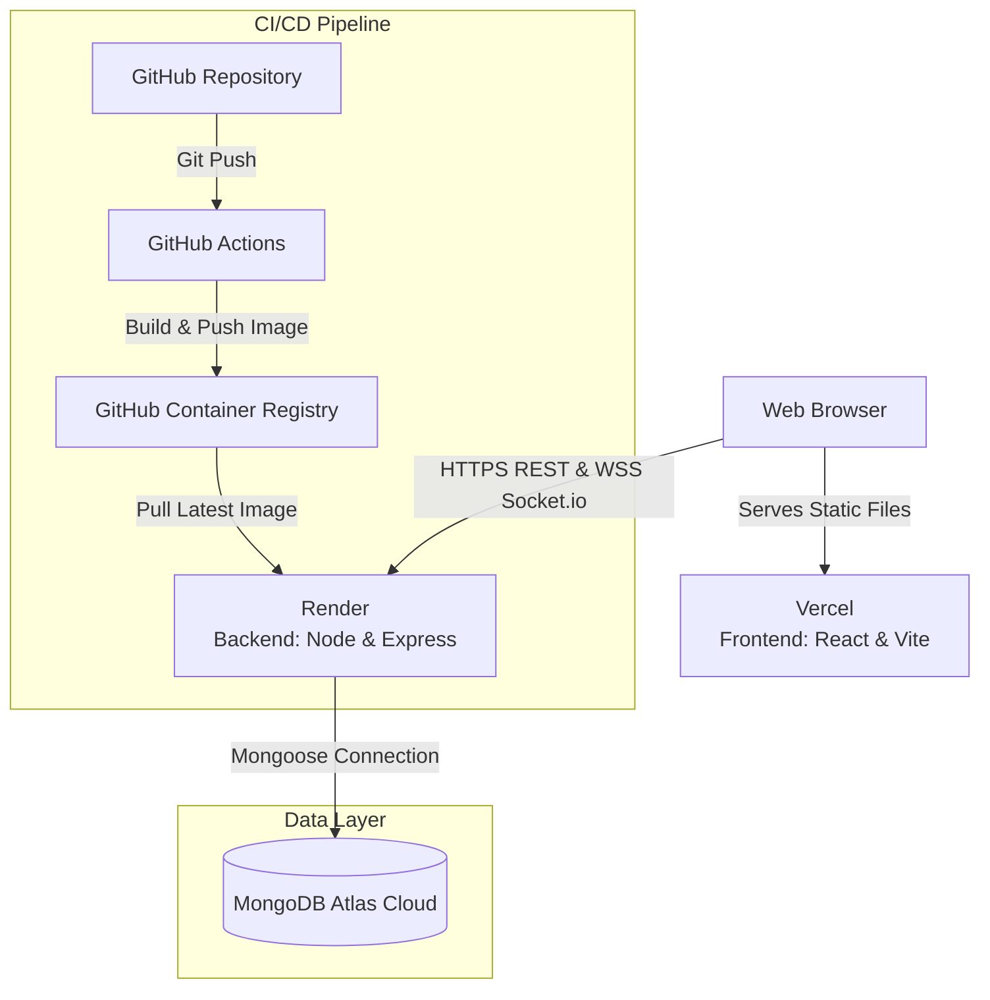

# Campus Skill Swap 🎓

A comprehensive campus skill swap platform built with the MERN stack. This application enables students to connect, share skills, and learn from each other in a structured, feedback-driven environment with real-time chat.

## 🏗️ System Architecture

The application is built using a modern, decoupled cloud architecture utilizing Docker and CI/CD pipelines.



### Infrastructure Stack
- **Frontend Hosting:** Vercel (Static Vite Build)
- **Backend Hosting:** Render (Docker Web Service)
- **Database:** MongoDB Atlas (Cloud Cluster)
- **Container Registry:** GitHub Container Registry (GHCR)
- **CI/CD:** GitHub Actions (Automated build, test, and push)

## 🌟 Features

- **🔐 Authentication**: Campus email verification with JWT tokens and bcrypt password hashing
- **👤 User Profiles**: Comprehensive profiles with skills offered, interests, and skills looking for
- **👥 Friend System**: Symmetrical friend requests with accept/decline functionality
- **💬 Real-time Chat**: One-to-one messaging between friends using Socket.io
- **🔄 Skill Swaps**: Structured skill exchange proposals and sessions
- **⭐ Feedback System**: Rating and review system for skill exchanges
- **🛡️ Admin Panel**: Comprehensive user monitoring and management tools
- **🤖 AI Chatbot**: Built-in Groq AI chatbot for learning assistance

## 🛠️ Tech Stack

### Frontend
- **React 18** + **Vite**
- **Material UI 5** for components
- **React Router 6** for client-side routing
- **Socket.io Client** for real-time communication

### Backend
- **Node.js / Express.js**
- **MongoDB** with Mongoose ODM
- **JWT** & **bcryptjs** for auth
- **Socket.io** for WebSockets
- **Docker** for containerization

## 🚀 Local Development Setup

### Prerequisites
- Node.js (v18 or higher)
- Local MongoDB instance or Atlas URI

### 1. Backend Setup
```bash
cd server
npm install

# Create a .env file based on env.example
cp env.example .env

# Edit .env with your local credentials:
# MONGODB_URI=mongodb://localhost:27017/campus-skill-swap
# PORT=5000
# CLIENT_URL=http://localhost:3000

# Start development server
npm run dev
```

### 2. Frontend Setup
```bash
cd client
npm install

# Create a .env.local file
echo "VITE_API_URL=http://localhost:5000/api" > .env.local
echo "VITE_SERVER_URL=http://localhost:5000" >> .env.local

# Start Vite development server
npm run dev
```

## 📁 Project Structure

```
campus-skill-swap/
├── .github/workflows/          # CI/CD Pipelines (ci.yml)
├── client/                     # React/Vite Frontend
│   ├── src/
│   ├── vite.config.js
│   └── vercel.json             # Vercel SPA routing rules
├── server/                     # Express/Node Backend
│   ├── Dockerfile              # Production Docker image blueprint
│   ├── routes/                 # API Routes
│   ├── models/                 # Mongoose Schemas
│   └── index.js                # Entry point
└── README.md
```

## 🚀 Production Deployment Details

### Frontend (Vercel)
- **Framework:** Vite
- **Root Directory:** `client`
- **Output Directory:** `build`
- **Environment Variables:** `VITE_API_URL`, `VITE_SERVER_URL`

### Backend (Render)
- **Deployment Method:** Docker Image from GHCR (`ghcr.io/your-username/campus-backend:latest`)
- **Port:** `5000` (Render binds automatically)
- **Environment Variables:** `MONGODB_URI`, `JWT_SECRET`, `GROQ_API_KEY`, `ALLOWED_DOMAINS`, `CLIENT_URL`

### CI/CD Workflow
Every push to the `main` branch triggers the GitHub Action (`.github/workflows/ci.yml`), which:
1. Checks out the code.
2. Runs backend health tests (`npm test`).
3. Builds the Docker image.
4. Pushes the image to GitHub Container Registry.
5. Render then pulls the updated image to deploy.
